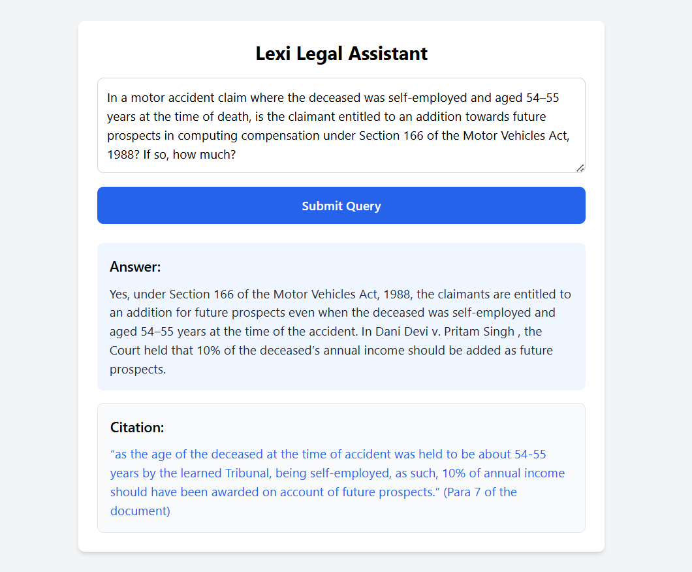

# Lexisg-frontend-intern-test

A modern React-based frontend interface simulating a Lexi-style legal assistant. Users can submit a legal query and view a generated answer with clickable citations that link to PDF evidence – mimicking how Lexi traces AI legal answers to real documents.


## ✨ Features

- ChatGPT-style legal assistant UI
- User can enter a legal question
- Displays AI-generated legal answer
- Shows citation with source and clickable link
- Opens PDF in a modal popup (with iframe embed)
- Smooth transitions and responsive design
- Built with Tailwind CSS for clean styling
## 🖼️ UI Preview

 *(Add your screenshot image here)*
## 🛠️ Tech Stack

- **React.js** – Frontend framework
- **Tailwind CSS** – Utility-first styling
- **JavaScript (ES6+)** – Logic & API simulation

## 📂 Project Structure

```
lexisg-frontend-intern-test/
├── public/
│ └── index.html
├── src/
│ ├── components/
│ │ ├── QueryInput.jsx
│ │ ├── AnswerCard.jsx
│ │ └── PDFModal.jsx
│ ├── App.jsx
│ ├── index.js
│ └── index.css
├── tailwind.config.js
├── postcss.config.js
└── README.md
```

## 📦 How to Run Locally

1. **Clone the repo**
   ```bash
   git clone https://github.com/yourusername/lexisg-frontend-intern-test.git
   cd lexisg-frontend-intern-test

   ```
2. Install dependencies

```
npm install
```
3. Start the dev server
```
npm start
```
4. View in browser
Navigate to http://localhost:3000
## 🧪 How Citation Linking Works

- When a query is submitted, a mock API returns a simulated legal answer and citation object.

- The citation includes a PDF link (e.g., court judgment).

- Clicking the citation opens a modal popup with the PDF embedded using an <iframe>.

- This simulates the Lexi feature that lets users trace an answer to a specific paragraph in a source document.